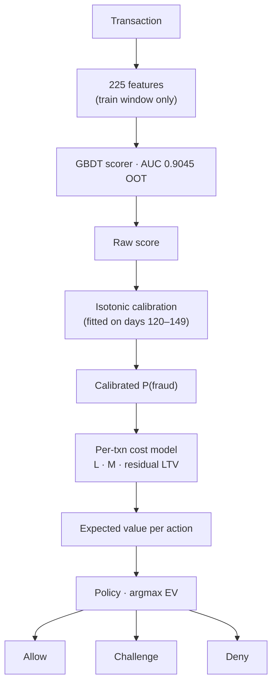
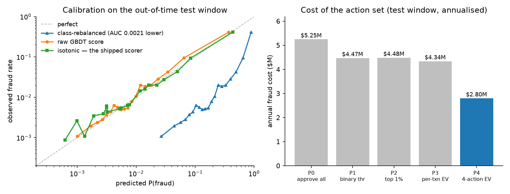

# Fraud Decisioning: from research finding to running system

[](https://github.com/Bhaskar-Kurasala/fraud-decisioning-reference-architecture/actions/workflows/ci.yml)
[](LICENSE)

Cost-sensitive fraud decisioning on real payment data (IEEE-CIS / Vesta), taken
from analysis through to a deployable service.

The project has two halves, and the second exists because of what the first
found:

**Part 1 — the research.** What the data actually says when you stop optimising
AUC and start optimising money. Seven stages, every number regenerable by one
command.

**Part 2 — the system.** The production layer built from those findings — a
scoring service, an append-only decision ledger, a maturity-gated retraining
flywheel, and an investigation API. 56 modules, 515 tests, 4 architecture
decision records.

> **Headline result.** On this data the **choice of action set is worth 3× more
> than any threshold tuning**, and a **class-rebalanced model whose AUC is
> 0.0021 lower — noise, by any review standard — costs $4.36M/yr** once its
> scores are routed through an economic policy.



> **At the calibration node** — skip this and it costs **$4.36M/yr** at a
> noise-level AUC gap (§2). **At the policy node** — the three-action set is
> worth **3× any threshold tuning** (§1). No review queue: §5 prices it at
> negative value for this merchant.



*Left: isotonic calibration on the out-of-time test window. The class-rebalanced
model (triangles) is better-ranked by AUC yet miscalibrated — it is the curve
furthest from the diagonal, and routing it through an economic policy costs
$4.36M/yr. Right: annual fraud cost under five action sets. The four-action EV
argmax (P4) cuts the approve-everything baseline by 47%.*

### Results at a glance

| Policy | Description | Annual cost | Δ vs P0 |
|---|---|---|---|
| P0 | Approve everything | $5.25M | — |
| P1 | Binary, global threshold (0.6981) | $4.47M | −15% |
| P3 | Binary, per-transaction EV threshold | $4.34M | −17% |
| **P4** | **Four-action EV argmax (allow / challenge / deny)** | **$2.80M** | **−47%** |

The 3× headline: the challenge arm alone recovers ~68% of the gain from P4 at
near-zero marginal cost. The calibration headline: the model with the better AUC
(AUC −0.0021, noise by any review standard) costs $4.36M/yr once its scores meet
a decision boundary.

---

## Navigation

| I want to… | Read |
|---|---|
| understand what the data said | [`fraud-decisioning-findings.md`](fraud-decisioning-findings.md) |
| understand how the system is built | [`docs/architecture.md`](docs/architecture.md) |
| see the decisions and their rejected alternatives | [`docs/adr/`](docs/adr/README.md) |
| run the stack | [`docs/operations/running-the-stack.md`](docs/operations/running-the-stack.md) |
| respond to an alert | [`docs/runbooks/`](docs/runbooks/) |
| integrate a case-management tool | [`docs/analyst-integration.md`](docs/analyst-integration.md) |
| know what an auditor can and cannot be told | [`docs/lineage.md`](docs/lineage.md) |
| reproduce the research | [`research/`](research/) + `./run_all.sh` |

---

# Part 1 — The research

## Quick start

```bash
python3 -m venv .venv && source .venv/bin/activate
pip install -r requirements.txt
./run_all.sh
```

`run_all.sh` downloads the data (~680MB), verifies checksums, and runs all seven
stages, logging each to `outputs/`. Roughly 15 minutes on 1 core / 3GB.

To change the business assumptions, edit `config.py` and rerun stages 5–6 only.

## Stages

| | Script | Produces | Time |
|---|---|---|---|
| 1 | `01_profile.py` | base rates, amount distribution, temporal drift, segments | ~1 min |
| 2 | `02_features.py` | `X.parquet`, `meta.parquet`, `feats.json` — 225 features, out-of-time split | ~4 min |
| 3 | `03_model.py` | `p_ca_raw.npy`, `p_te_raw.npy` — champion GBDT | ~3 min |
| 3b | `03b_calibrate.py` | `scored_test.parquet` — isotonic calibration + reliability | ~10 s |
| 4 | `04b_ltv.py` | `tenure_econ.csv` — survivorship-corrected LTV per tenure | ~2 min |
| 5 | `05_economics.py` | `econ_test.parquet`, `policies.csv` — EV, policies, boundaries | ~20 s |
| 6 | `06_full.py` | miscalibration cost, capacity, sensitivity, label latency, P&L | ~30 s |

Stages 5 and 6 are the analysis; 1–4 exist to feed them.

`research/architect-blueprint-notes.md` is the thinking that preceded the code —
the model-portfolio and economics reasoning used to decide what was worth
building. Notes, not a deliverable.

## Split

Strictly out-of-time. Day index = `(TransactionDT − min) // 86400`.

```
train  day   0–119   414,542 txns   3.52% fraud
calib  day 120–149    83,571 txns   3.41% fraud   <- isotonic fitted here only
test   day 150–181    92,427 txns   3.48% fraud   <- every reported number
```

The calibration slice is separate from test. Fitting isotonic on test would make
the calibration results meaningless.

## Leakage controls

- Frequency encodings and entity amount-aggregates fitted on the **train window
  only**, then mapped forward. Unseen levels → 0 / NaN.
- Velocity features (`*_secs_prev`, `*_amt_prev`, `*_amt_cummean`) built with
  `shift`/`cumsum` on time-sorted data — backward-looking by construction.
- Customer proxy `uid = card1_card2_addr1_(D1−day)` is the standard IEEE-CIS
  construction: same physical card + address + first-seen date.

Out-of-time **AUC 0.9045, PR-AUC 0.527**. Deliberately lower than the ~0.94 on
the Kaggle leaderboard, where entity aggregates are computed over the combined
train+test set. That leaks future information and is not available at decision
time.

## Business layer

Costs are per transaction, not global:

```
L_i = Amount_i × COGS + CB_FEE + OPS_DISPUTE           # false negative
M_i = Amount_i × MARGIN + relationship_cost(tenure_i)  # false positive
```

`relationship_cost = P(churn|declined) × residual_LTV`, both per tenure bucket.

**`residual_LTV` is measured**, not assumed. Derived in `04b_ltv.py` from
observed spend, corrected for survivorship: conditioning on customers with ≥2
transactions inflated new-customer LTV from $323 to $1,999. The fix measures
`P(repeat)` directly (44.5% across 151,928 customers observable for ≥60 days)
and takes `LTV = P(repeat) × value_if_repeat × discount`.

**`P(churn|declined)` is the one input with no data support here.** It is
tenure-graded from published false-decline research. It is the softest number in
the model and the first thing to challenge.

## Reproducibility

**Determinism.** Seeds in `config.py`: `SEED=42` (model), `SEED_LABEL_SIM=7`
(chargeback-lag simulation). HistGradientBoosting with a fixed `random_state` is
deterministic for a given thread count; results validated single-core. All
economics downstream of the saved `.npy` scores are exactly deterministic.

**Constants.** Every business assumption lives in `config.py` and nowhere else.
No script hardcodes a cost. If a number appears in the report it traces to
`config.py` or to the data.

**Validation.** Refactoring stages 2–6 to read from `config.py` reproduced every
figure bit-identically ($2,799,797 P4 annual cost, 0.328–0.789 boundary spread).

## Known limitations

1. **No exploration holdout.** This data contains only transactions the original
   issuer approved and observed. Selection bias from their declines is
   uncorrected and, with this dataset, unmeasurable.
2. **Challenge and review outcomes are counterfactual.** Realised P&L uses true
   labels for the loss and expected values for the intervention. `F_PASS`,
   `A_ABANDON` and `Q_ANALYST` are vendor/ops parameters, not fitted — hence the
   sensitivity grid in stage 6.
3. **`P(churn|declined)` is assumed** (see above).
4. **Label latency is simulated, not observed.** IEEE-CIS labels are final. The
   stage-6 experiment injects a lognormal chargeback lag to demonstrate the
   failure mode; it does not measure it in this data.
5. **Single merchant, single 182-day window, one adversary regime.** The
   direction of the findings should generalise; the magnitudes should not be
   transplanted.
6. **No fairness or disparate-impact analysis.** IEEE-CIS carries no protected
   attributes. For that dimension use the Bank Account Fraud (NeurIPS 2022)
   dataset, which ships protected attributes deliberately.

---

# Part 2 — The system

Full design: [`docs/architecture.md`](docs/architecture.md).

## What the findings forced

| Finding | The architectural consequence |
|---|---|
| §1 — the challenge arm is worth 3× threshold tuning | A three-action policy (`allow` / `challenge` / `deny`), not a binary classifier. `INCLUDE_REVIEW` has no default, so the choice cannot be made by omission. |
| §2 — miscalibration costs $4.36M/yr at a noise-level AUC gap | The promotion gate is keyed on **expected cost**, never on AUC. A challenger that improves AUC and worsens ECE is rejected. |
| §5 — review is positive on 5 of 92,427 transactions | **No review queue.** The humans in this system are dispute handlers and adverse-action responders; they get an investigation API. ([ADR-0004](docs/adr/0004-no-analyst-review-queue.md)) |
| §6 — observed fraud collapses to 6.9% of true on recent windows | Retraining triggers on **label-free Tier 0 signals**; promotion waits for **maturity-gated Tier 2** metrics. A performance-keyed trigger would fire a quarter late. |

## Layout

```
src/fraudlens/
  serving/      request path — scoring, decisioning, case API, case view
  flywheel/     retrain trigger, shadow scoring, promotion gate, rollback
  monitoring/   drift, label maturity, the five metric tiers
  lineage/      decision replay, model card
  streaming/    append-only ledger, delayed labels, label provenance
  policy/       the decision boundary and the fail-safe rule ladder
  economics/    the cost model: L, M, relationship_cost, label value
  models/       scorer, calibration, registry, promotion gate, checks
  features/     tenure buckets, amount bands
  config/       business constants
```

Dependencies flow strictly downward and the ordering is enforced at build time
by `import-linter`. Two placements are load-bearing:

- **economics sits below policy** — the cost model is testable without importing
  the rule that consumes it.
- **flywheel sits below serving** — a retraining decision is structurally
  unreachable from the request path, so it cannot end up inside a 150 ms budget.

## Running it

```bash
uv sync --all-extras
uv run pytest -m "not integration"       # 515 tests, no Docker needed

# The smallest runnable stack: API + Postgres + migrations
docker compose -f deploy/compose/docker-compose.yml --profile core up -d --wait

# Everything: adds MLflow, Prometheus, Grafana
docker compose -f deploy/compose/docker-compose.yml --profile full up -d --wait
```

See [`docs/operations/running-the-stack.md`](docs/operations/running-the-stack.md)
for profiles, health endpoints, and what to do when it will not come up.

## Endpoints

| | What it does | Latency budget |
|---|---|---|
| `POST /v1/decide` | Score → calibrate → policy → ledger | **150 ms p99** (§4.3) |
| `GET /v1/cases/{id}` | The full investigation view of one recorded decision | none — off the checkout path |
| `GET /cases/{id}` | The same, rendered as a page for a dispute desk | none |
| `GET /metrics` | Prometheus exposition | — |
| `GET /health/live`, `/health/ready` | Liveness and readiness | — |

## What this system deliberately does not do

Each refusal is measured, not accidental:

- **No review queue** — §5 prices it at $14,783/yr worse than having none.
- **No per-feature attribution** — no champion artifact exists, and the ledger
  stores `input_hash` rather than feature values. A fabricated explanation on an
  adverse-action notice is a compliance problem, not a quality one.
- **No performance-based retrain trigger** — it would fire a quarter after the
  traffic that broke the model.
- **No speculative extension points** — no interface with zero implementations.

## Quality gates

```bash
uv run ruff check src tests      # lint
uv run mypy                      # strict type checking
uv run lint-imports              # layered architecture contract
uv run pytest -m "not integration"
```

All four run in CI on every push (`.github/workflows/ci.yml`).

---

## Files

```
config.py                       research constants, paths, seeds
run_all.sh                      full research pipeline
research/                       the seven analysis stages + architect notes
fraud-decisioning-findings.md   the write-up
src/fraudlens/                  the production system
tests/                          515 tests
deploy/                         compose stack + k8s manifests
docs/                           architecture, ADRs, runbooks, operations
```
